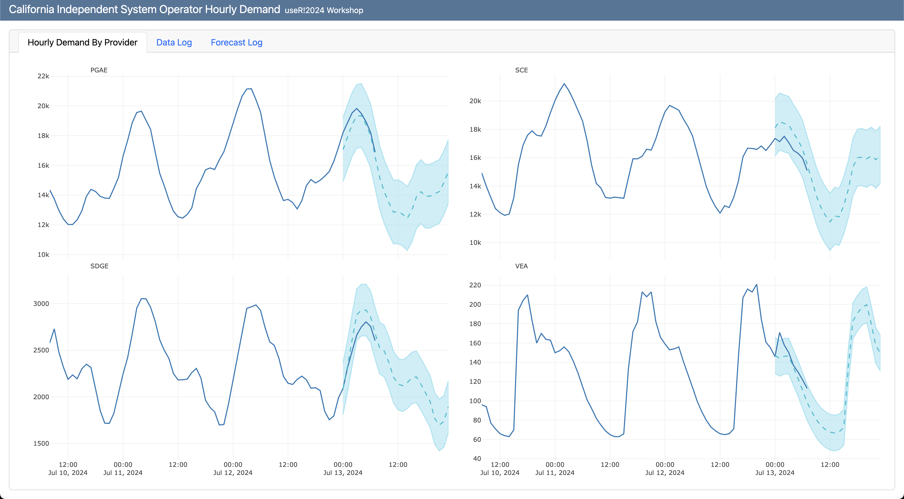

# Deploy and Monitor ML Pipelines with Open Source and Free Applications

WIP...pre-spell check

Materials for the **Deploy and Monitor ML Pipelines with Open Source and Free Applications** workshop at the [useR!2024](https://events.linuxfoundation.org/user/) conference. The session is virtual and open for registration over [here](https://events.linuxfoundation.org/user/program/virtual-schedule/).

When 📆: Tuesday, July 2nd, 10:00 PST

The workshop is based on the LinkedIn Learning course - [Data Pipeline Automation with GitHub Actions](https://www.linkedin.com/learning/data-pipeline-automation-with-github-actions-using-r-and-python/), code is available [here](https://github.com/LinkedInLearning/data-pipeline-automation-with-github-actions-4503382).

The workshop will focus on different deployment designs of machine learning pipelines using R, open-source applications, and free-tier tools. We will use the US hourly demand for electricity data from the EIA API to demonstrate the deployment of a pipeline with GitHub Actions and Docker that fully automates the data refresh process and generates a forecast on a regular basis. This includes the use of open-source tools such as point-blank to monitor the health of the data and the model's success. Last but not least, we will use Quarto doc to set up the monitoring dashboard and deploy it on GitHub Pages.

<figure>
 </a>
<figcaption> Forecasting the demand for electricity in California</figcaption>
</figure>

 
 

## Resources

- Docker documentation: https://docs.docker.com/
- Dev Containers Extension: https://marketplace.visualstudio.com/items?itemName=ms-vscode-remote.remote-containers
- GitHub Actions documentation: https://docs.github.com/en/actions

## License
This tutorial is licensed under a [Creative Commons Attribution-NonCommercial-ShareAlike 4.0 International](https://creativecommons.org/licenses/by-nc-sa/4.0/) License.
