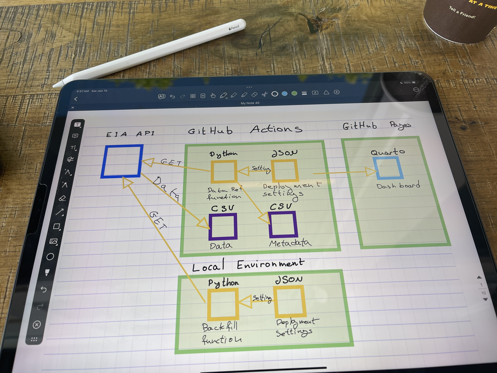
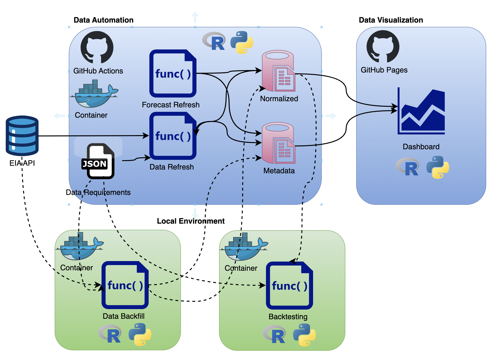
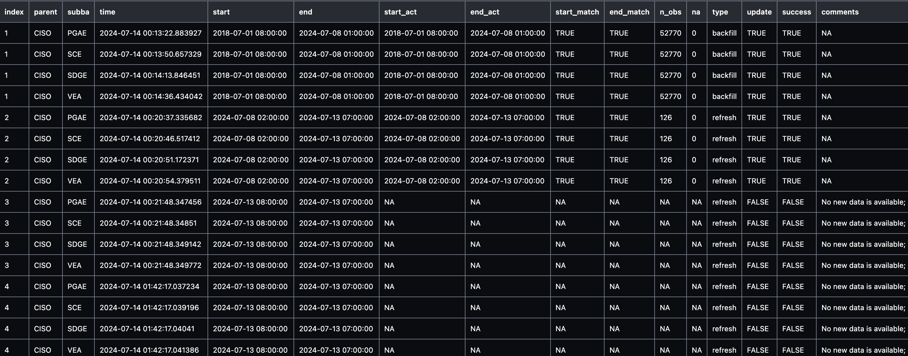
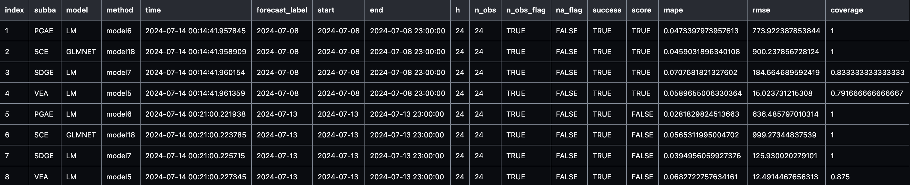

# Deploy and Monitor ML Pipelines with Open Source and Free Applications

WIP...pre-spell check

Materials for the **Deploy and Monitor ML Pipelines with Open Source and Free Applications** workshop at the [useR!2024](https://events.linuxfoundation.org/user/) conference. The session is virtual and open for registration over [here](https://events.linuxfoundation.org/user/program/virtual-schedule/).

When 📆: Tuesday, July 2nd, 10:00 PST

The workshop is based on the LinkedIn Learning course - [Data Pipeline Automation with GitHub Actions](https://www.linkedin.com/learning/data-pipeline-automation-with-github-actions-using-r-and-python/), code is available [here](https://github.com/LinkedInLearning/data-pipeline-automation-with-github-actions-4503382).

The workshop will focus on different deployment designs of machine learning pipelines using R, open-source applications, and free-tier tools. We will use the US hourly demand for electricity data from the EIA API to demonstrate the deployment of a pipeline with GitHub Actions and Docker that fully automates the data refresh process and generates a forecast on a regular basis. This includes the use of open-source tools such as point-blank to monitor the health of the data and the model's success. Last but not least, we will use Quarto doc to set up the monitoring dashboard and deploy it on GitHub Pages.


<figure>
 </a>
<figcaption> Forecasting the demand for electricity in California</figcaption>
</figure>

<br>
<br />


## Milestones
To organize and track the project requirements, we will set up a GitHub Project, create general milestones, and use issues to define sub-milestone. For setting up a data/ML pipeline, we will define the following milestones:
- Define scope and requirements:
    - Pipeline scope
    - Forecasting scope
- General tools and requirements 
    - Set a development environment:
    - Set a Docker image
    - Update the Dev Containers settings
- Data pipeline prototype:
    - Create pipeline schema/draft
    - Build a prototype
    - Test deployment on GitHub Actions
- Set forecasting models:
    - Create an MLflow experiment
    - Set backtesting function
    - Define forecasting models
    - Test and evaluate the models' performance
    - Select the best model for deployment
- Set a Quarto dashboard:
    - Create a Quarto dashboard
    - Track the data and forecast
    - Monitor performance 
- Productionize the pipeline:
    - Clean the code
    - Define unit tests
- Deploy the pipeline and dashboard to GitHub Actions and GitHub Pages:
    - Create a GitHub Actions workflow
    - Refresh the data and forecast
    - Update the dashboard 


The milestones are available in the repository [issues section](https://github.com/RamiKrispin/useR2024-pipeline-workshop/milestones), and you can track them on the [project tracker](https://github.com/users/RamiKrispin/projects/7/views/1).


<figure>
 </a>
<figcaption> The project tracker</figcaption>
</figure>

<br>
<br />

## Scope

**Goal:** Forecast the hourly demand for electricity in the California Independent System Operator subregion (CISO). 

This includes the following four providers:
- Pacific Gas and Electric (PGAE)
- Southern California Edison (SCE)
- San Diego Gas and Electric (SDGE)
- Valley Electric Association (VEA)

**Forecast Horizon:** 24 hours
**Refresh:** Every 24 hours


### Data 
The data is available on the [EIA API](https://www.eia.gov/opendata/), the API [dashboard provides](https://www.eia.gov/opendata/browser/electricity/rto/region-sub-ba-data?frequency=hourly&data=value;&facets=parent;&parent=CISO;&sortColumn=period;&sortDirection=desc;) the GET setting to pull the above series.

 
<figure>
 </a>
<figcaption> The GET request details from the EIA API dashboard</figcaption>
</figure>

<br>
<br />

### General Requirements
- The following functions:
    - Data backfill function
    - Data refresh function
    - Forecast function
    - Metadata function
- Docker image
- EIA API key

## Set a Development Environment

To make the deployment to GitHub Actions seamless, we will use Docker. In addition, we will set up a development environment using VScode and the Dev Containers extension.

### Docker Settings

To make the deployment to GitHub Actions seamless, we will use Docker. This will enable us to ship our code to GitHub Actions using the same environment we used to develop and test our code. Typically, I split my image build process for R into two steps:
- Base image - setting the R and its dependencies and VScode requirements for R
- Project image - adding on top of the base image the required R libraries for the project

For this workshop, the base-R image:


``` Dockerfile
FROM ubuntu:22.04

LABEL maintainer="Rami Krispin"

# Set R version
ARG R_VERSION_MAJOR=4
ARG R_VERSION_MINOR=4
ARG R_VERSION_PATCH=0
ENV R_VERSION_MAJOR=$R_VERSION_MAJOR
ENV R_VERSION_MINOR=$R_VERSION_MINOR
ENV R_VERSION_PATCH=$R_VERSION_PATCH
# Setting the Python version
ARG PYTHON_VER=3.10
ENV PYTHON_VER=$PYTHON_VER
ARG VENV_NAME="r-env"
ENV VENV_NAME=$VENV_NAME
ARG QUARTO_VERSION=1.5.43
ENV QUARTO_VERSION=$QUARTO_VERSION
ENV TZ=UTC
ENV DEBIAN_FRONTEND=noninteractive
ENV CONFIGURE_OPTIONS="--with-cairo --with-jpeglib --enable-R-shlib --with-blas --with-lapack"
# CRAN Mirror
ARG CRAN_MIRROR=https://cran.rstudio.com/
ENV CRAN_MIRROR=$CRAN_MIRROR
# Create a directory for packages builds
RUN mkdir pkgs

COPY setting_files/*.sh setting_files/requirements.txt pkgs/

# Install Debian dependencies
RUN bash pkgs/install_debian.sh


# Installing R
RUN wget https://cran.rstudio.com/src/base/R-${R_VERSION_MAJOR}/R-${R_VERSION_MAJOR}.${R_VERSION_MINOR}.${R_VERSION_PATCH}.tar.gz && \
    tar zxvf R-${R_VERSION_MAJOR}.${R_VERSION_MINOR}.${R_VERSION_PATCH}.tar.gz && \
    rm R-${R_VERSION_MAJOR}.${R_VERSION_MINOR}.${R_VERSION_PATCH}.tar.gz

WORKDIR /R-${R_VERSION_MAJOR}.${R_VERSION_MINOR}.${R_VERSION_PATCH}

RUN ./configure ${CONFIGURE_OPTIONS} && \
    make && \
    make install

RUN locale-gen en_US.UTF-8

WORKDIR /


RUN bash pkgs/install_python.sh $VENV_NAME

RUN bash pkgs/install_quarto.sh $QUARTO_VERSION

COPY setting_files/*.R setting_files/*.json pkgs/
RUN mv pkgs/packages_vscode.json pkgs/packages.json
RUN Rscript pkgs/install_packages.R
RUN rm pkgs/*.*


COPY setting_files/.Rprofile root/
RUN echo "alias r='radian --profile=~/.Rprofile'" >> ~/.bashrc


```

And the project image:

```Dockerfile
ARG CPU="arm64"

FROM docker.io/rkrispin/baser:${CPU}.4.4.0

COPY setting_files/install_packages.R setting_files/packages.json pkgs/

RUN Rscript pkgs/install_packages.R
```

The build files can be found in the [docker](https://github.com/RamiKrispin/useR2024-pipeline-workshop/tree/main/docker) folder.


**Note:** GitHub Actions, by default, does not support ARM64 processer but AMD64 (e.g., Intel). Therefore, if you are using Apple Silicon (M1/M2/M3) or any other ARM64-based machine, you will have to use [Docker BuildX](https://docs.docker.com/reference/cli/docker/buildx/) or similar to build the image to AMD64 architecture.

### VScode Dev Containers Setting

We will use the following `devcontainer.json` file to set the development environment:

``` JSON
{
    "name": "useR!2024 Workshop",
    "image": "docker.io/rkrispin/user2024workshop:${localEnv:CPU}.4.4.0",
    "customizations": {
        "vscode": {
            "extensions": [
                // R Extensions
                "reditorsupport.r",
                "rdebugger.r-debugger",
                // Documentation Extensions
                "quarto.quarto",
                "purocean.drawio-preview",
                "redhat.vscode-yaml",
                "yzhang.markdown-all-in-one",
                // Docker Supporting Extensions
                "ms-azuretools.vscode-docker",
                "ms-vscode-remote.remote-containers",
                // Python Extensions
                "ms-python.python",
                "ms-toolsai.jupyter"
            ]
        }
    },
    "remoteEnv": {
        "EIA_API_KEY": "${localEnv:EIA_API_KEY}"
    }
}
```
If you want to learn more about setting up a dockerized development environment with the Dev Containers extension, please check the [Python](https://github.com/RamiKrispin/vscode-python) and [R](https://github.com/RamiKrispin/vscode-r) tutorials.

## Pipeline Design

Once we have a clear scope, we can start designing the pipeline. The pipeline has the following two main components:

- Data refresh
- Forecasting model

I typically start with drafting the process using paper and pencil (or the electronic version using iPad and Apple Pencil 😎). This helps me to understand better what functions I need to build:

<figure>
 </a>
<figcaption> The data and models pipeline draft</figcaption>
</figure>

<br>
<br />

Drawing the pipeline components and sub-components helps us plan the required functions that we need to build.

Drawing the pipeline components and sub-components helps us plan the required functions that we need to build. Once the pipeline is ready, I usually create a design blueprint to document the process:

<figure>
 </a>
<figcaption> The pipeline final design</figcaption>
</figure>

<br>
<br />


The pipeline will have the following two components:

- Data refresh function to keep the data up-to-date
- Forecast refresh to keep the forecast up-to-date

In addition, we will use the following two functions locally to prepare the data and models:

- Backfill function to initiate (or reset) the data pipeline
- Backtesting function to train, test, and evaluate time series models

We will set the pipeline to render and deploy a dashboard on GitHub pages whenever we refresh the data or the forecast.

We will use a [JSON file](https://github.com/RamiKrispin/useR2024-pipeline-workshop/blob/main/settings/settings.json) to define the pipeline settings. This will enable us to seamlessly modify or update the pipeline without changing the functions. For example, we will define the required series from the EIA API under the series section:

``` JSON
"series": [
        {
            "parent_id": "CISO",
            "parent_name": "California Independent System Operator",
            "subba_id": "PGAE",
            "subba_name": "Pacific Gas and Electric"
        },
        {
            "parent_id": "CISO",
            "parent_name": "California Independent System Operator",
            "subba_id": "SCE",
            "subba_name": "Southern California Edison"
        },
        {
            "parent_id": "CISO",
            "parent_name": "California Independent System Operator",
            "subba_id": "SDGE",
            "subba_name": "San Diego Gas and Electric"
        },
        {
            "parent_id": "CISO",
            "parent_name": "California Independent System Operator",
            "subba_id": "VEA",
            "subba_name": "Valley Electric Association"
        }
    ]
```

Last but not least, we will create two `CSV` files to store the data and the metadata.

### Data

To pull the data from the EIA API, we will use [EIAapi](https://github.com/RamiKrispin/EIAapi) library. The EIAapi library provides functions to query and pull tidy data from EIA API v2

**Note:** The EIA API is open and free to use, and required an API key. To create an API key go to [EIA API website](https://www.eia.gov/opendata/) and follow the registration instructions.

In addition, we will use a set of funtions to process the data and log metadata, customized for our use case. Those functions can be found on the [eia_data.R](https://github.com/RamiKrispin/useR2024-pipeline-workshop/blob/main/pipeline/eia_data.R) script under the [pipeline](https://github.com/RamiKrispin/useR2024-pipeline-workshop/tree/main/pipeline) folder.


### Forecasting Models

The second component of the pipeline is setting up the forecasting models, this includes:
- Create a backtesting framework to test and evaluate models performance. This includes the following steps:
    - Define models
    - Define backtesting settings
    - Run the models and Log their performance
    - Log for each series the best model
- For the demonstration, we will use the following models from the [Modeltime](https://business-science.github.io/modeltime/index.html) library:
    - Linear Regresion
    - GLMNET
    - Prophet


We will use different flavors of those models, create a "horse race" between them, and select the one that performs best.

**Note:** We will run the backtesting process locally to avoid unnecessary compute time.

We will run an experiment with MLflow using different flavors of those models and evaluate which one performs best for each series. We will use the settings.json file to store the model's settings and backtesting parameters:

``` JSON
 "models": {
            "model1": {
                "function_type": "linear_reg",
                "engine": "lm",
                "formula": "y ~ trend"
            },
            "model2": {
                "function_type": "linear_reg",
                "engine": "lm",
                "formula": "y ~ trend + month"
            },
            "model3": {
                "function_type": "linear_reg",
                "engine": "lm",
                "formula": "y ~ trend + month + wday"
            },
            "model4": {
                "function_type": "linear_reg",
                "engine": "lm",
                "formula": "y ~ trend + month + wday + hour"
            },
            "model5": {
                "function_type": "linear_reg",
                "engine": "lm",
                "formula": "y ~ trend + month + wday + hour + lag_24 + lag_48"
            },
            "model6": {
                "function_type": "linear_reg",
                "engine": "lm",
                "formula": "y ~ trend + month + wday + hour + lag_24 + lag_48 + lag_72"
            },
            "model7": {
                "function_type": "linear_reg",
                "engine": "lm",
                "formula": "y ~ trend + month + wday + hour + lag_24 + lag_48 + lag_72 + lag_8760"
            },
            "model8": {
                "function_type": "prophet_reg",
                "engine": "prophet",
                "formula": "y ~ time"
            },
            "model9": {
                "function_type": "linear_reg",
                "function_args": "mixture = 0, penalty = 1",
                "engine": "glmnet",
                "formula": "y ~ trend + month + wday + hour"
            },
            "model10": {
                "function_type": "linear_reg",
                "function_args": "mixture = 0.25, penalty = 1",
                "engine": "glmnet",
                "formula": "y ~ trend + month + wday + hour"
            },
            "model11": {
                "function_type": "linear_reg",
                "function_args": "mixture = 0.5, penalty = 1",
                "engine": "glmnet",
                "formula": "y ~ trend + month + wday + hour"
            },
            "model12": {
                "function_type": "linear_reg",
                "function_args": "mixture = 0.75, penalty = 1",
                "engine": "glmnet",
                "formula": "y ~ trend + month + wday + hour"
            },
            "model13": {
                "function_type": "linear_reg",
                "function_args": "mixture = 1, penalty = 1",
                "engine": "glmnet",
                "formula": "y ~ trend + month + wday + hour"
            },
            "model14": {
                "function_type": "linear_reg",
                "function_args": "mixture = 1, penalty = 10",
                "engine": "glmnet",
                "formula": "y ~ trend + month + wday + hour"
            },
            "model16": {
                "function_type": "linear_reg",
                "function_args": "mixture = 0, penalty = 1",
                "engine": "glmnet",
                "formula": "y ~ trend + month + wday + hour + lag_24 + lag_25 + lag_26 + lag_27 + lag_28 + lag_48"
            },
            "model17": {
                "function_type": "linear_reg",
                "function_args": "mixture = 0.5, penalty = 1",
                "engine": "glmnet",
                "formula": "y ~ trend + month + wday + hour + lag_24 + lag_25 + lag_26 + lag_27 + lag_28 + lag_48"
            },
            "model18": {
                "function_type": "linear_reg",
                "function_args": "mixture = 1, penalty = 1",
                "engine": "glmnet",
                "formula": "y ~ trend + month + wday + hour + lag_24 + lag_25 + lag_26 + lag_27 + lag_28 + lag_48+ lag_72"
            }
        }
```


## Metadata
Setting logs and metadata collection enables us to monitor the health of the pipeline and identify problems when they occur. Here are some of the metrics we will collect:

- **Data refresh log:** Track the data refresh process and log critical metrics such as the time of the refresh, the time range of the data points, unit test results, etc.


<figure>
 </a>
<figcaption> The data pipeline log</figcaption>
</figure>
<br>
<br />

- **Forecasting models:** Define the selected model per series based on the backtesting evaluation results

<figure>
 </a>
<figcaption> The selected forecasting models</figcaption>
</figure>

<br>
<br />


- **Forecast refresh log:** Track the forecasting models refresh. This includes the time of refresh, forecast label, and performance metrics
<figure>
 </a>
<figcaption> The forecasting models log</figcaption>
</figure>
<br>
<br />

## Dashboard

After we set the pipeline's data and forecast refresh functions, the last step is to set a dashboard that presents the outputs (e.g., data, forecast, metadata, etc.). For this task, we will use a [Quarto dashboard](https://quarto.org/docs/dashboards/) to set a simple dashboard that presents the most recent forecast and the pipeline metadata:

<figure>
 </a>
<figcaption> The pipeline Quarto dashboard</figcaption>
</figure>
<br>
<br />

The dashboard is static, so we can deploy it on [GitHub Pages](https://pages.github.com/) as a static website. We will set the pipeline to rerender the dashboard and deploy it on GitHub Pages every time new data is available. The dashboard code and website are available [here](https://github.com/RamiKrispin/ai-dev-2024-ml-workshop/blob/main/functions/index.qmd) and [here](https://ramikrispin.github.io/ai-dev-2024-ml-workshop/), respectively.

## Deployment

The last step of this pipeline setting process is to deploy it to GitHub Actions. We will use the following workflow to deploy the pipeline:

`data_refresh.yml`
```yaml
name: Data Refresh

on:
  schedule:
    - cron: "0 */1 * * *"
jobs:
  refresh-the-dashboard:
    runs-on: ubuntu-22.04
    container:
      image: docker.io/rkrispin/user2024workshop:amd64.4.4.0
    steps:
      - name: checkout_repo
        uses: actions/checkout@v3
        with:
          ref: "main"
      - name: Data Refresh
        run: bash ./pipeline/data_refresh.sh
        env:
          EIA_API_KEY: ${{ secrets.EIA_API_KEY }}
          USER_EMAIL: ${{ secrets.USER_EMAIL }}
          USER_NAME: ${{ secrets.USER_NAME }}
```

This simple workflow is set to run every hour. It uses the project image - `docker.io/rkrispin/user2024workshop:amd64.4.4.0` as the environment. We use the built-in action - `actions/checkout@v3`to check out the repo, access it, commit chnages and write it back to the repo.


Last but not least, we will execute the following bash script:

`data_refresh_py.sh`
``` bash
#!/usr/bin/env bash
source /opt/$VENV_NAME/bin/activate 

rm -rf ./pipeline/data_refresh_files
rm ./pipeline/data_refresh.html
quarto render ./pipeline/data_refresh.qmd --to html

rm -rf docs/data_refresh/
mkdir docs/data_refresh
cp ./pipeline/data_refresh.html ./docs/data_refresh/
cp -R ./pipeline/data_refresh_files ./docs/data_refresh/

echo "Finish"
p=$(pwd)
git config --global --add safe.directory $p

if [[ "$(git status --porcelain)" != "" ]]; then
    rm -rf ./docs/index_files/
    rm docs/index.html
    quarto render pipeline/index.qmd
    cp ./pipeline/index.html ./docs/
    cp -R ./pipeline/index_files/ ./docs/index_files/
    git config --global user.name $USER_NAME
    git config --global user.email $USER_EMAIL
    git add data/*
    git add docs/*
    git commit -m "Auto update of the data"
    git push origin main
else
echo "Nothing to commit..."
fi
```

This bash script renders the quarto doc with the data and forecast refresh functions. It then checks if new data points are available, and if so, it will render the dashboard and commit the changes (e.g., append changes to the CSV files).

Note that you will need to set the following three secrets:
- `EIA_API_KEY` - the EIA API key
- `USER_EMAIL` - the email address associated with the GitHub account
- `USER_NAME` - the GitHub account user name


## Resources

- Data Pipeline Automation with GitHub Actions - https://www.linkedin.com/learning/data-pipeline-automation-with-github-actions-using-r-and-python/
- Modeltime - https://business-science.github.io/modeltime/
- Quarto - https://quarto.org/
- Docker documentation: https://docs.docker.com/
- Dev Containers Extension: https://marketplace.visualstudio.com/items?itemName=ms-vscode-remote.remote-containers
- GitHub Actions documentation: https://docs.github.com/en/actions

## License
This tutorial is licensed under a [Creative Commons Attribution-NonCommercial-ShareAlike 4.0 International](https://creativecommons.org/licenses/by-nc-sa/4.0/) License.
