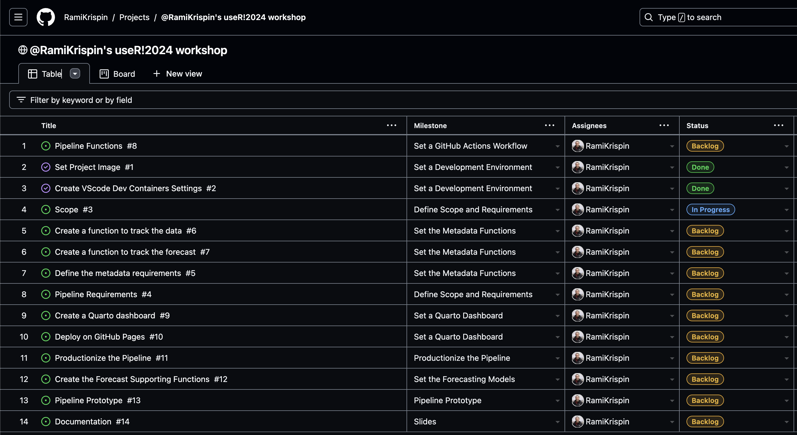
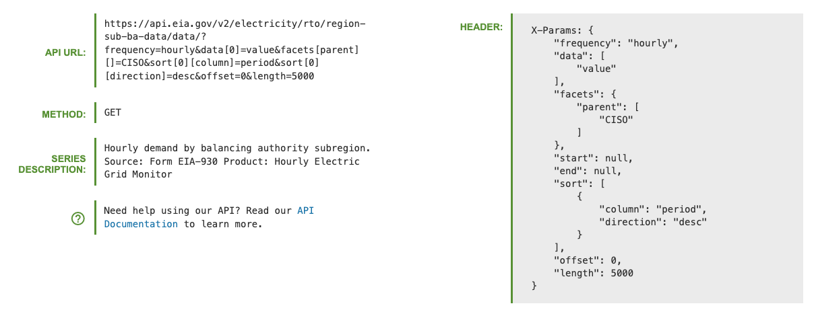

# Deploy and Monitor ML Pipelines with Open Source and Free Applications

WIP...pre-spell check

Materials for the **Deploy and Monitor ML Pipelines with Open Source and Free Applications** workshop at the [useR!2024](https://events.linuxfoundation.org/user/) conference. The session is virtual and open for registration over [here](https://events.linuxfoundation.org/user/program/virtual-schedule/).

When 📆: Tuesday, July 2nd, 10:00 PST

The workshop is based on the LinkedIn Learning course - [Data Pipeline Automation with GitHub Actions](https://www.linkedin.com/learning/data-pipeline-automation-with-github-actions-using-r-and-python/), code is available [here](https://github.com/LinkedInLearning/data-pipeline-automation-with-github-actions-4503382).

The workshop will focus on different deployment designs of machine learning pipelines using R, open-source applications, and free-tier tools. We will use the US hourly demand for electricity data from the EIA API to demonstrate the deployment of a pipeline with GitHub Actions and Docker that fully automates the data refresh process and generates a forecast on a regular basis. This includes the use of open-source tools such as point-blank to monitor the health of the data and the model's success. Last but not least, we will use Quarto doc to set up the monitoring dashboard and deploy it on GitHub Pages.


<figure>
 </a>
<figcaption> Forecasting the demand for electricity in California</figcaption>
</figure>

<br>
<br />


## Milestones
To organize and track the project requirements, we will set up a GitHub Project, create general milestones, and use issues to define sub-milestone. For setting up a data/ML pipeline, we will define the following milestones:
- Define scope and requirements:
    - Pipeline scope
    - Forecasting scope
- General tools and requirements 
    - Set a development environment:
    - Set a Docker image
    - Update the Dev Containers settings
- Data pipeline prototype:
    - Create pipeline schema/draft
    - Build a prototype
    - Test deployment on GitHub Actions
- Set forecasting models:
    - Create an MLflow experiment
    - Set backtesting function
    - Define forecasting models
    - Test and evaluate the models' performance
    - Select the best model for deployment
- Set a Quarto dashboard:
    - Create a Quarto dashboard
    - Track the data and forecast
    - Monitor performance 
- Productionize the pipeline:
    - Clean the code
    - Define unit tests
- Deploy the pipeline and dashboard to GitHub Actions and GitHub Pages:
    - Create a GitHub Actions workflow
    - Refresh the data and forecast
    - Update the dashboard 


The milestones are available in the repository [issues section](https://github.com/RamiKrispin/useR2024-pipeline-workshop/milestones), and you can track them on the [project tracker](https://github.com/users/RamiKrispin/projects/7/views/1).


<figure>
 </a>
<figcaption> The project tracker</figcaption>
</figure>

<br>
<br />

## Scope

**Goal:** Forecast the hourly demand for electricity in the California Independent System Operator subregion (CISO). 

This includes the following four providers:
- Pacific Gas and Electric (PGAE)
- Southern California Edison (SCE)
- San Diego Gas and Electric (SDGE)
- Valley Electric Association (VEA)

**Forecast Horizon:** 24 hours
**Refresh:** Every 24 hours


### Data 
The data is available on the [EIA API](https://www.eia.gov/opendata/), the API [dashboard provides](https://www.eia.gov/opendata/browser/electricity/rto/region-sub-ba-data?frequency=hourly&data=value;&facets=parent;&parent=CISO;&sortColumn=period;&sortDirection=desc;) the GET setting to pull the above series.

 
<figure>
 </a>
<figcaption> The GET request details from the EIA API dashboard</figcaption>
</figure>

<br>
<br />

### General Requirements
- The following functions:
    - Data backfill function
    - Data refresh function
    - Forecast function
    - Metadata function
- Docker image
- EIA API key

## Set a Development Environment

To make the deployment to GitHub Actions seamless, we will use Docker. In addition, we will set up a development environment using VScode and the Dev Containers extension.

### Docker Settings

To make the deployment to GitHub Actions seamless, we will use Docker. This will enable us to ship our code to GitHub Actions using the same environment we used to develop and test our code. Typically, I split my image build process for R into two steps:
- Base image - setting the R and its dependencies and VScode requirements for R
- Project image - adding on top of the base image the required R libraries for the project

For this workshop, the base-R image:


``` Dockerfile
FROM ubuntu:22.04

LABEL maintainer="Rami Krispin"

# Set R version
ARG R_VERSION_MAJOR=4
ARG R_VERSION_MINOR=4
ARG R_VERSION_PATCH=0
ENV R_VERSION_MAJOR=$R_VERSION_MAJOR
ENV R_VERSION_MINOR=$R_VERSION_MINOR
ENV R_VERSION_PATCH=$R_VERSION_PATCH
# Setting the Python version
ARG PYTHON_VER=3.10
ENV PYTHON_VER=$PYTHON_VER
ARG VENV_NAME="r-env"
ENV VENV_NAME=$VENV_NAME
ARG QUARTO_VERSION=1.5.43
ENV QUARTO_VERSION=$QUARTO_VERSION
ENV TZ=UTC
ENV DEBIAN_FRONTEND=noninteractive
ENV CONFIGURE_OPTIONS="--with-cairo --with-jpeglib --enable-R-shlib --with-blas --with-lapack"
# CRAN Mirror
ARG CRAN_MIRROR=https://cran.rstudio.com/
ENV CRAN_MIRROR=$CRAN_MIRROR
# Create a directory for packages builds
RUN mkdir pkgs

COPY setting_files/*.sh setting_files/requirements.txt pkgs/

# Install Debian dependencies
RUN bash pkgs/install_debian.sh


# Installing R
RUN wget https://cran.rstudio.com/src/base/R-${R_VERSION_MAJOR}/R-${R_VERSION_MAJOR}.${R_VERSION_MINOR}.${R_VERSION_PATCH}.tar.gz && \
    tar zxvf R-${R_VERSION_MAJOR}.${R_VERSION_MINOR}.${R_VERSION_PATCH}.tar.gz && \
    rm R-${R_VERSION_MAJOR}.${R_VERSION_MINOR}.${R_VERSION_PATCH}.tar.gz

WORKDIR /R-${R_VERSION_MAJOR}.${R_VERSION_MINOR}.${R_VERSION_PATCH}

RUN ./configure ${CONFIGURE_OPTIONS} && \
    make && \
    make install

RUN locale-gen en_US.UTF-8

WORKDIR /


RUN bash pkgs/install_python.sh $VENV_NAME

RUN bash pkgs/install_quarto.sh $QUARTO_VERSION

COPY setting_files/*.R setting_files/*.json pkgs/
RUN mv pkgs/packages_vscode.json pkgs/packages.json
RUN Rscript pkgs/install_packages.R
RUN rm pkgs/*.*


COPY setting_files/.Rprofile root/
RUN echo "alias r='radian --profile=~/.Rprofile'" >> ~/.bashrc


```

And the project image:

```Dockerfile
ARG CPU="arm64"

FROM docker.io/rkrispin/baser:${CPU}.4.4.0

COPY setting_files/install_packages.R setting_files/packages.json pkgs/

RUN Rscript pkgs/install_packages.R
```

The build files can be found in the [docker](https://github.com/RamiKrispin/useR2024-pipeline-workshop/tree/main/docker) folder.


## Resources

- Docker documentation: https://docs.docker.com/
- Dev Containers Extension: https://marketplace.visualstudio.com/items?itemName=ms-vscode-remote.remote-containers
- GitHub Actions documentation: https://docs.github.com/en/actions

## License
This tutorial is licensed under a [Creative Commons Attribution-NonCommercial-ShareAlike 4.0 International](https://creativecommons.org/licenses/by-nc-sa/4.0/) License.
